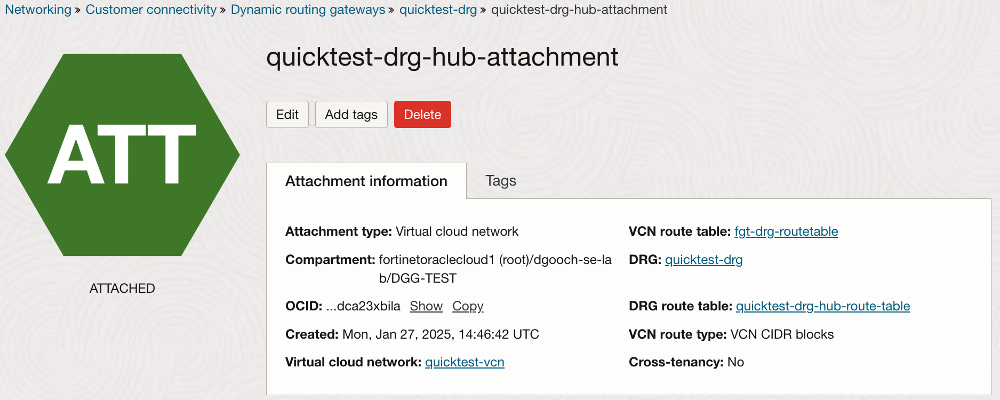
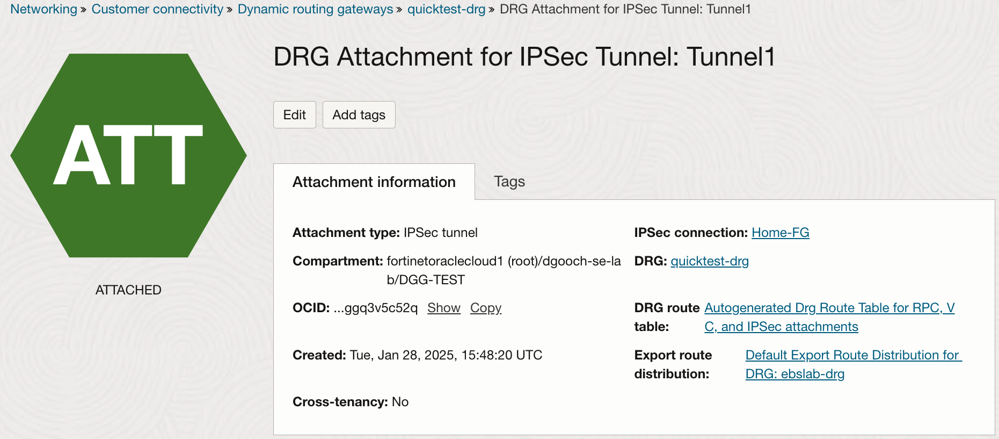
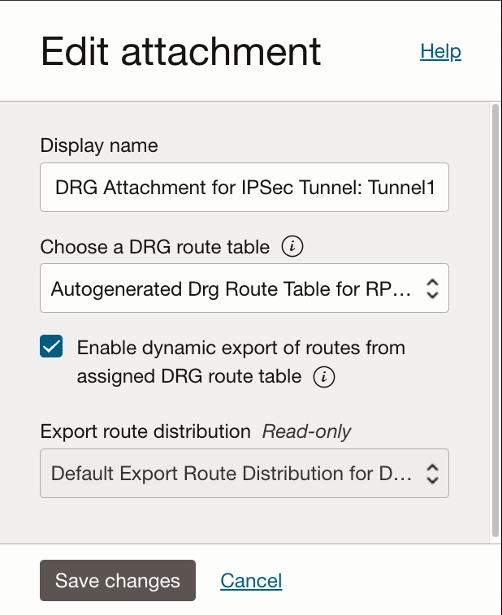
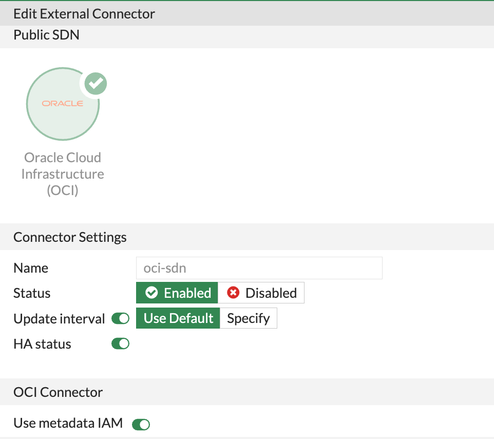
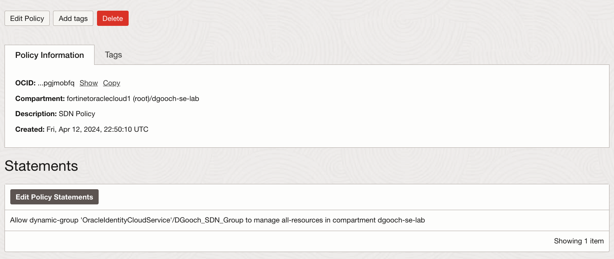
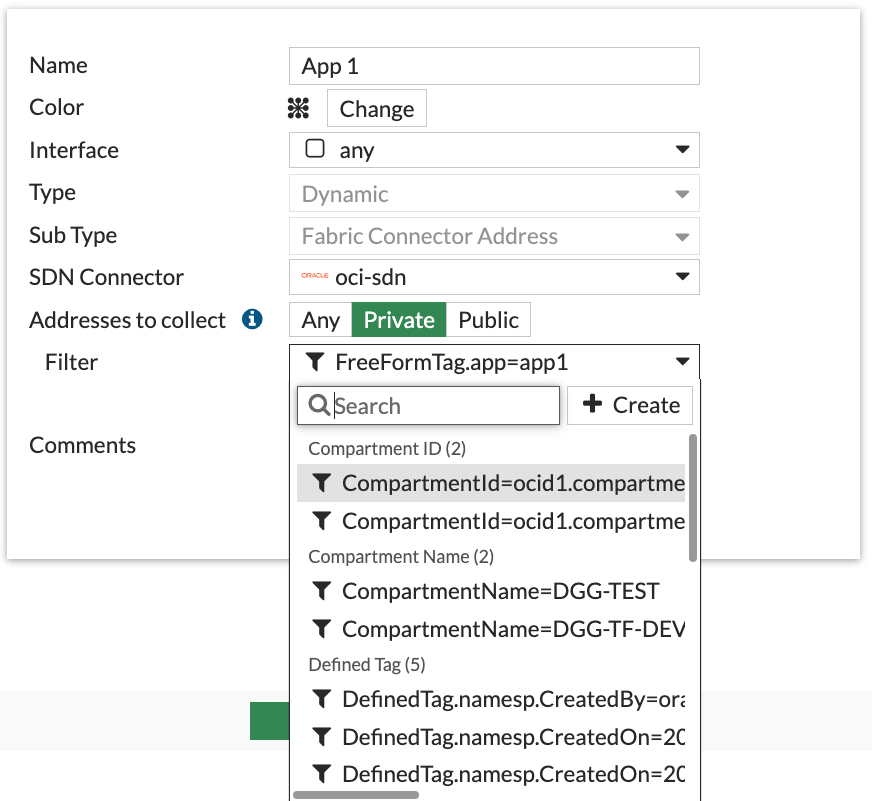
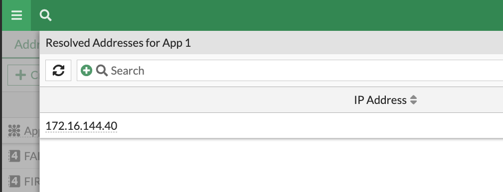

# FortiGate and FortiWeb OCI Deployment

## Introduction

This document is designed to help readers understand deployment of FortiGate and FortiWeb in OCI. It will describe VCN network setup and routing requirements necessary to deploy FortiGate in parallel with FortiWeb in a “Security Services VCN” within Oracle Cloud Infrastructure (OCI).

Figure 1: OCI Sample Environment

## Virtual Networks

It is useful to explain how traffic will flow in this environment. The above diagram is the sample network we will use. All production applications will be in the “App” VCNs. Local intra-VCN traffic will be forwarded using the intrinsic router for each VCN. Traffic between App VCNs and outbound to the internet will be sent over DRG attachments. Traffic ingress from on-premises will come in over a IPSec directly into the DRG. By default, the DRG routing tables would forward traffic directly to the appropriate VCN attachment. While this is fast, and efficient, we have limited visibility, and security capabilities. Manipulation of the DRG routing tables gives us the ability to send East/West as well as North/South traffic to the Security Services VCN for service insertion.

### Security Services VCN

In our diagram, we only picture FortiGate and FortiWeb in the Security Services VCN. Depending on the customer’s requirement, you could also deploy FortiManager and FortiAnalyzer here. As we will remember, those services only require IP reachability to the managed resources, meaning that we could potentially place them on-prem or in another cloud location.

Unless otherwise stated, we will use regional subnets in OCI. This greatly simplifies routing and HA across availability domains.

### Subnet Routing Tables

This setup requires a few more tables due to the nature of the architecture. As you can see there are no routes pointing directly to the FortiGate. This is due to NLB handling traffic distribution with the FortiGates as “Backends” in a “Backend Set”.

Table 1: NLB Subnet Routing Table

| Destination | Target Type | Target | Route Type |
| --- | --- | --- | --- |
| 0.0.0.0/0 | Internet Gateway | ebslab-igw | Static |

Table 2: Untrust Subnet Routing Table

| Destination | Target Type | Target | Route Type |
| --- | --- | --- | --- |
| 0.0.0.0/0 | Internet Gateway | ebslab-igw | Static |

Table 3: Trust Subnet Routing Table

| Destination | Target Type | Target | Route Type |
| --- | --- | --- | --- |
| 0.0.0.0/0 | Private-IP | &lt;Internal NLB IP&gt; | Static |
| &lt;App 1 VCN CIDR&gt; | Dynamic Routing Gateway | &lt;DRG&gt; | Static |
| &lt;App n VCN CIDR&gt; | Dynamic Routing Gateway | &lt;DRG&gt; | Static |
| &lt;On-prem CIDR&gt; | Dynamic Routing Gateway | &lt;DRG&gt; | Static |

As noted here the trust subnet route table points all traffic destined for the Internet towards the internal NLB private IP address. All other routes for any internal services need to be added here, pointing back to the DRG.

### Spoke VCNs

The route Tables here are very simple, pointing all inter-VCN and internet traffic towards the DRG.

Table 4: Trust Subnet Routing Table

| Destination | Target Type | Target | Route Type |
| --- | --- | --- | --- |
| 0.0.0.0/0 | Dynamic Routing Gateway | &lt;DRG&gt; | Static |

## DRG

The Dynamic Routing Gateway (DRG) will play a key role by intercepting inter-VCN, outbound internet and on-prem traffic, using attachment routing tables. We are concerned with three attachment types:

- VCN attachment: used to attach VCNs to DRG

- Virtual Circuit attachment: used for FastConnect attachment to DRG

- IPSec Tunnel attachment: used when terminating IPSec to DRG

- Remote Peering Connection (RPC) attachment: used when attaching DRG to Peered DRG in another account or region.

### VCN Attachment Route Tables

For each VCN attachment, there are two Routing Tables. The first is the “DRG Route Table”, which determines how traffic will be handled inbound from the VCN to the DRG via the attachment. The second is the “VCN Route Table”, which handles traffic outbound from the DRG to the VCN via the attachment.

Figure 2: Hub to DRG attachment

#### DRG Route Table

Every attachment must have a DRG Route Table explicitly defined. You can re-use the same route table across multiple VCN attachments.

The below table is for the Security Services (hub) VCN attachment. Note that all of the routes here are Dynamic. These are the result of adding a Route Distribution Rule, which Matches all routes known to the DRG.

Table 5: DRG Route Table for Security Services VCN Attachment

| Destination | Next Hop Attachment Type | Next Hop Attachment | Route Type |
| --- | --- | --- | --- |
| 0.0.0.0/0 | Virtual Cloud Network | &lt;Sec Services VCN Attachment&gt; | Dynamic |
| &lt;On-Prem CIDR&gt; | Virtual Circuit | &lt;On-prem IPSec&gt; | Dynamic |
| &lt;App 1 VCN CIDR&gt; | Virtual Cloud Network | &lt;App 1 VCN Attachment&gt; | Dynamic |
| &lt;App 2 VCN CIDR&gt; | Virtual Cloud Network | &lt;App 2 VCN Attachment&gt; | Dynamic |
| &lt;Sec Services CIDR&gt; | Virtual Cloud Network | &lt;Sec Services VCN Attachment&gt; | Dynamic |
| &lt;RPC CIDR&gt; | Remote Peering Connection | &lt;RPC Attachment&gt; | Dynamic |

The below table shows DRG routes for the Application VCNs. For these attachments, we need to disable Import Route Distribution and add a static default route pointing to the Security Services VCN attachment. If we allow import distribution for this routing table, the Security Services VCN will be bypassed for Inter-VCN and VCN to On-prem traffic.

Table 6: DRG Route Table for App n VCN Attachment

| Destination | Next Hop Attachment Type | Next Hop Attachment | Route Type |
| --- | --- | --- | --- |
| 0.0.0.0/0 | Virtual Cloud Network | &lt;Sec Services VCN Attachment&gt; | Static |

#### VCN Route Table

If no VCN Route Table is explicitly defined, then the hidden implicit table is used to provide connectivity to all subnets in the VCN.

In our solution, we will only define a VCN route table for the Security Services VCN attachment. This route will point all traffic inbound from the DRG sent to the internal NLB for distribution to the FortiGates.

Table 7: VCN Route Table for Security Services VCN Attachment

| Destination | Target Type | Next Hop Attachment Type | Route Type |
| --- | --- | --- | --- |
| 0.0.0.0/0 | Private IP | &lt;Internal NLB IP&gt; | Static |

### RPC, VC and IPSec Attachment Route Tables

RPC, VC and IPSec attachments share two routing constructs by default. These are “DRG route table” and “Export route distribution”.

Figure 3: IPSec to DRG attachment

#### DRG Route Table

By default, the IPSec attachment has an auto-generated route table which is shared with the Virtual Circuit and RPC attachments. This table will import all routes known by the DRG (with their respective VCN attachments). This is problematic if we want to inspect the traffic before forwarding, since it is directly forwarded by the DRG to the VCN, bypassing FortiGate. In our architecture, we need to intercept that traffic and send it to the Security Services VCN. As such, we can modify this table (or create a new one) to disable Import Route Distribution and add static routes for each VCN CIDR pointing to the Security Services VCN attachment.

Table 8: DRG Route Table for RPC, VC and IPSec Attachments

| Destination | Next Hop Attachment Type | Next Hop Attachment | Route Type |
| --- | --- | --- | --- |
| &lt;App 1 VCN CIDR&gt; | Virtual Cloud Network | &lt;Sec Services VCN Attachment&gt; | Static |
| &lt;App 2 VCN CIDR&gt; | Virtual Cloud Network | &lt;Sec Services VCN Attachment&gt; | Static |
| &lt;RPC CIDR&gt; | Virtual Cloud Network | &lt;Sec Services VCN Attachment&gt; | Static |

---

**Default Route note**: If you use a default route in this table, depending on the option chosen for Export Route Distribution, the DRG will attempt to advertise it. Caution is advised, as a misconfiguration on the remote device or service could cause unintended traffic to flow over this attachment.

---

#### Export Route Distribution

By default there is an export route distribution rule in place that matches all routes known by the DRG and accepts them. This distribution rule cannot be edited, only enabled or disabled. When enabled, the routes that are exported come from the DRG Route Table (see Table 9 above) associated with this attachment. If you choose not to distribute routes dynamically, you will need to use static routes on the remote device or service.

The example below shows the Edit attachment popup for an IPSec attachment. Selecting “Enable dynamic export…” will cause DRG to advertise those routes via BGP.

Figure 4: Edit Attachment

Figure 5 below gives a big picture view of the resulting route tables.

Figure 5: Routing Big Picture

# Fortinet Services

For this document, we will only focus on deployment of FortiGate and FortiWeb.

## FortiGate

In our diagram, FortiGates are deployed between two OCI network load balancers (NLB). The external NLB has a public IP Address, which will be used to accept and distribute inbound traffic from remote users. The internal load balancer in this architecture will distribute both Northbound and East/West Traffic to the FortiGates for inspection. FortiGate could also be used in conjunction with FortiClient EMS and/or FortiSASE to provide secured (ZTNA, IPsec, SSL VPN) remote access to users.

The use of NLB facilitates both Active/Active (A/A) and Active/Passive (A/P) FortiGate Deployment. The decision between A/A and A/P is dependent on required features. If horizontal scaling is needed, A/A is the indicated architecture. If IPsec tunnels will be terminated directly on FortiGate, A/P is recommended.

---

**NAT note**: In most cases customers will deploy FortiGate policies for the trust interface which use Source NAT (SNAT) based on the outbound interface IP. This is useful, in A/A deployments to ensure that return traffic for a session is processed by the same FortiGate. In some cases, customers would like to preserve the Source IP of the packets. In this case, SNAT can be disabled on FortiGate. Customers will need to enable Symmetric Hash on the internal network load balancer, in order to ensure traffic is returned to the correct FortiGate.

---

### FortiGate Routing Tables

FortiGate will use static routing for the CIDR blocks. It is possible for FortiGate to BGP Peer with On-prem network device, you just open TCP port 179 in the appropriate security lists.

Table 9: FortiGate Routing Table

| Destination | Target Type | Target | Route Type |
| --- | --- | --- | --- |
| 0.0.0.0/0 | Interface | Untrust Interface | Static |
| &lt;App 1 VCN CIDR&gt; | Interface | Trust Interface | Static |
| &lt;App n VCN CIDR&gt; | Interface | Trust Interface | Static |
| &lt;On-prem CIDR&gt; | Interface | Trust Interface | Static or BGP |

### FortiGate SDN Connector

The FortiGate SDN connector connects to the OCI API gateway and performs two functions:

1. Gathers device metadata for all VMs configured OCI compartments. This Metadata can then be used to create dynamic address objects within security policies.
2. Provides “SDN Failover” of A/P FortiGate. In the event of a failure of the primary device, the Passive FortiGate becomes active and sends an API call to move the Public IP and internal Static route from the previously active device to itself.

#### FortiGate Connector Configuration

We will be using the metadata IAM for this example. This uses the device ID of the FortiGate in order to authenticate to the OCI API. This can be configured under Security Fabric > External Connectors

The below example shows “Advanced Type”, wich allows us to specify multiple server region types and compartments.

Figure 6: FortiGate SDN Connector Configuration

#### OCI Policy Configuration

In order for the FortiGate IAM connector to work, we must configure a policy within OCI which allow access.

The first step is to create a dynamic group under Identity > Domains > YourDomain > Dynamic Groups and then add the FortiGate’s instance OCID to the Matching rules.

Figure 7: Configure Dynamic Group

After the Group is configured, you must create a policy, which grants the necessary privileges to the Group. If SDN failover is required, you will need to specify the “manage” verb in the policy. This allows the SDN connector to move the IPs and routes. If you only need device metadata, you can use the “read” verb in your policy.

Figure 8: OCI Policy

#### FortiGate Dynamic Address Object

Once the connector is up and functioning properly, users can configure dynamic address objects under Policy & Objects > Addresses. There are a number of filters to choose from when creating the object. In the example below, a free form tag is used to identify our application. It is more common to tag groups of devices based on administrative and security requirements.

Figure 9: Configure Dynamic Address

Once the configuration is complete, you can hover over the address and view a list of IPs which resolve to the applied filter:

Figure 10: Verify Address Object

## FortiWeb

Fortiweb will be deployed in reverse proxy mode, protecting an application in the App 1 VCN from threats on the Internet. For A/A and horizontal scaling, either an external Network Load Balancer or Application Load Balancer can be used to distribute traffic to FortiWeb. Because FortiWeb is serving as a reverse proxy, traffic to the application server (or internal load balancer) will be SNAT based on the trust interface of FortiWeb. This ensures that return traffic is sent to the appropriate device.

---

**Routing note**: In the below section discussing VCN routing table, we will see that there is a default route pointing all traffic inbound from DRG to internal network load balancer (and then to FortiGate). Because of SNAT of FortiWeb traffic, a more specific route to the Trust subnet CIDR exists, and thus traffic will be forwarded directly back to FortiWeb

---

Table 10: FortiWeb Routing Table

| Destination | Target Type | Target | Route Type |
| --- | --- | --- | --- |
| 0.0.0.0/0 | Interface | Untrust Interface | Static |
| &lt;App IP or CIDR&gt; | Interface | Trust Interface | Static |

## Useful Links

FortiGate OCI deployment guide:

<https://docs.fortinet.com/document/fortigate-public-cloud/7.4.0/oci-administration-guide/16658/about-fortigate-vm-for-oci>

Terraform deployment templates:

<https://github.com/40net-cloud/fortinet-oci-solutions/tree/main>
